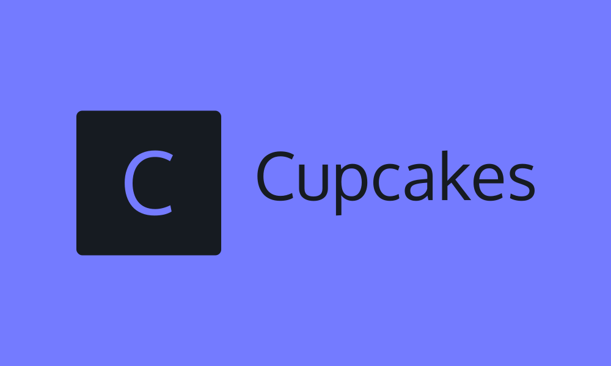

[![Contributors][contributors-shield]][contributors-url]
[![Forks][forks-shield]][forks-url]
[![Stargazers][stars-shield]][stars-url]
[![Issues][issues-shield]][issues-url]
[![MIT License][license-shield]][license-url]

<!-- PROJECT LOGO -->
<br />
<div align="center">
  <a href="https://github.com/sophiabrandt/cupcakes-preact-vite">
    
  </a>

  <h3 align="center">cupcakes-preact-vite</h3>

  <p align="center">
    Playground for a Preact application using Vite and Vitest
    <br />
    <a href="https://github.com/sophiabrandt/cupcakes-preact-vite"><strong>Explore the docs »</strong></a>
    <br />
    <br />
    <a href="https://github.com/sophiabrandt/cupcakes-preact-vite">View Demo</a>
    ·
    <a href="https://github.com/sophiabrandt/cupcakes-preact-vite/issues">Report Bug</a>
    ·
    <a href="https://github.com/sophiabrandt/cupcakes-preact-vite/issues">Request Feature</a>
  </p>
</div>

<!-- TABLE OF CONTENTS -->
<details>
  <summary>Table of Contents</summary>
  <ol>
    <li>
      <a href="#about-the-project">About The Project</a>
      <ul>
        <li><a href="#built-with">Built With</a></li>
      </ul>
    </li>
    <li>
      <a href="#getting-started">Getting Started</a>
      <ul>
        <li><a href="#prerequisites">Prerequisites</a></li>
        <li><a href="#installation">Installation</a></li>
      </ul>
    </li>
    <li><a href="#usage">Usage</a></li>
    <li><a href="#roadmap">Roadmap</a></li>
    <li><a href="#contributing">Contributing</a></li>
    <li><a href="#license">License</a></li>
    <li><a href="#contact">Contact</a></li>
    <li><a href="#acknowledgments">Acknowledgments</a></li>
  </ol>
</details>

<!-- ABOUT THE PROJECT -->

## About The Project

The project is an experiment in learning how Vite and Vitest work with Preact. TypeScript is a must!

<p align="right">(<a href="#readme-top">back to top</a>)</p>

### Built With

Made with [Vite](Vite-url), [Vitest](https://vitest.dev), [Preact][preact-url].

- [![Vite][vite]][vite-url]
- [![Preact][preact.js]][preact-url]

<p align="right">(<a href="#readme-top">back to top</a>)</p>

<!-- GETTING STARTED -->

## Getting Started

You need Node.js. I use Node 14.20.

### Prerequisites

(Optional)

- pnpm
  ```sh
  npm install pnpm@latest -g
  ```

### Installation

1. Clone the repo
   ```sh
   git clone https://github.com/sophiabrandt/cupcakes-preact-vite.git
   ```
2. Install NPM packages
   ```sh
   pnpm install
   ```

<p align="right">(<a href="#readme-top">back to top</a>)</p>

<!-- USAGE EXAMPLES -->

## Usage

- Development

  ```sh
  pnpm run dev
  ```

- Tests

  ```sh
  pnpm run test
  ```

For more options, check the script section of [package.json](./package.json).

<p align="right">(<a href="#readme-top">back to top</a>)</p>

<!-- ROADMAP -->

## Roadmap

See the [open issues](https://github.com/sophiabrandt/cupcakes-preact-vite/issues) for a full list of proposed features (and known issues).

<p align="right">(<a href="#readme-top">back to top</a>)</p>

<!-- CONTRIBUTING -->

## Contributing

Contributions are what make the open source community such an amazing place to learn, inspire, and create. Any contributions you make are **greatly appreciated**.

If you have a suggestion that would make this better, please fork the repo and create a pull request. You can also simply open an issue with the tag "enhancement".
Don't forget to give the project a star! Thanks again!

1. Fork the Project
2. Create your Feature Branch (`git checkout -b feature/AmazingFeature`)
3. Commit your Changes (`git commit -m 'Add some AmazingFeature'`)
4. Push to the Branch (`git push origin feature/AmazingFeature`)
5. Open a Pull Request

<p align="right">(<a href="#readme-top">back to top</a>)</p>

<!-- LICENSE -->

## License

Distributed under the MIT License. See `LICENSE.txt` for more information.

<p align="right">(<a href="#readme-top">back to top</a>)</p>

<!-- CONTACT -->

## Contact

[Sophia Brandt](https://sophiabrandt.com) - [@hisophiabrandt](https://twitter.com/hisophiabrandt)

<p align="right">(<a href="#readme-top">back to top</a>)</p>

<!-- ACKNOWLEDGMENTS -->

## Acknowledgments

- [Dev Mastery](https://github.com/dev-mastery/comments-api)
- [Othneil Drew](https://github.com/othneildrew/Best-README-Template)

<p align="right">(<a href="#readme-top">back to top</a>)</p>

<!-- MARKDOWN LINKS & IMAGES -->
<!-- https://www.markdownguide.org/basic-syntax/#reference-style-links -->

[contributors-shield]: https://img.shields.io/github/contributors/sophiabrandt/cupcakes-preact-vite.svg?style=for-the-badge
[contributors-url]: https://github.com/sophiabrandt/cupcakes-preact-vite/graphs/contributors
[forks-shield]: https://img.shields.io/github/forks/sophiabrandt/cupcakes-preact-vite.svg?style=for-the-badge
[forks-url]: https://github.com/sophiabrandt/cupcakes-preact-vite/network/members
[stars-shield]: https://img.shields.io/github/stars/sophiabrandt/cupcakes-preact-vite.svg?style=for-the-badge
[stars-url]: https://github.com/sophiabrandt/cupcakes-preact-vite/stargazers
[issues-shield]: https://img.shields.io/github/issues/sophiabrandt/cupcakes-preact-vite.svg?style=for-the-badge
[issues-url]: https://github.com/sophiabrandt/cupcakes-preact-vite/issues
[license-shield]: https://img.shields.io/github/license/sophiabrandt/cupcakes-preact-vite.svg?style=for-the-badge
[license-url]: https://github.com/sophiabrandt/cupcakes-preact-vite/blob/master/LICENSE.txt
[linkedin-shield]: https://img.shields.io/badge/-LinkedIn-black.svg?style=for-the-badge&logo=linkedin&colorB=555
[linkedin-url]: https://linkedin.com/in/sophiabrandt
[vite]: https://img.shields.io/badge/Vite.js-20232A?style=for-the-badge&logo=vite&logoColor=747bff
[vite-url]: https://vitejs.dev/
[preact.js]: https://img.shields.io/badge/Preact.js-20232A?style=for-the-badge&logo=preact&logoColor=673ab8
[preact-url]: https://preactjs.com/
